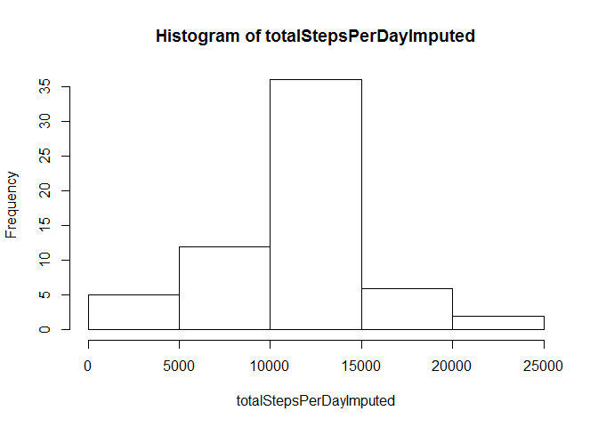

# Reproducible Research: Peer Assessment 1


## Loading and preprocessing the data

Begin by loading the data. We assume that the activity data is in a subdirectory of the working directory, called "activity".


```r
fileName <- list.files(path=".", pattern="activity.csv", recursive=TRUE)
activityData <- read.csv(fileName[1])
```


## What is mean total number of steps taken per day?
First, we remove the rows with NA number of steps.


```r
activityDataNoNA <- subset(activityData, !is.na(activityData$steps))
totalStepsPerDay <- tapply(activityDataNoNA$steps, as.factor(activityDataNoNA$date), sum)

hist(totalStepsPerDay)
```

 

```r
meanTotalStepsPerDay = mean(totalStepsPerDay, na.rm=TRUE)
medianTotalStepsPerDay = median(totalStepsPerDay, na.rm=TRUE)
```

The mean number of total steps per day is 1.0766189\times 10^{4}.
The median number of total steps per day is 10765.

## What is the average daily activity pattern?
For each time interval, we now average across days.


```r
averageStepsPerInterval <- tapply(activityDataNoNA$steps, as.factor(activityDataNoNA$interval), mean, na.rm=TRUE)

plot(as.numeric(names(averageStepsPerInterval)), averageStepsPerInterval, type='l', xlab='interval', main='Average Steps Per Interval')
```

 

```r
maxInterval <- names(which.max(averageStepsPerInterval))
```
The interval with the maximum number of steps, averaged across all days, is 835.


## Imputing missing values

Let's find the number of rows that have missing values for the number of steps.

```r
numberMissing <- sum(is.na(activityData$steps))
```
There are 2304 missing entries.

Let's replace each missing value with the mean value for the corresponding interval. We will find the rows with missing values, determine the interval for that row, and then fill the steps for that row with the average steps for that interval.

```r
activityDataImputedSteps <- activityData

## Find the indices of rows with missing values. We could do this with one line,  but writing out the loop is cleaner.
missingRows <- which(is.na(activityDataImputedSteps$steps))
for (row in missingRows){
  whichInterval <- activityDataImputedSteps[row, "interval"]
  activityDataImputedSteps[row, "steps"] <- averageStepsPerInterval[as.character(whichInterval)]
}

totalStepsPerDayImputed <- tapply(activityDataImputedSteps$steps, as.factor(activityDataImputedSteps$date), sum)

hist(totalStepsPerDayImputed)
```

 

```r
meanTotalStepsPerDayImputed = mean(totalStepsPerDayImputed, na.rm=TRUE)
medianTotalStepsPerDayImputed = median(totalStepsPerDayImputed, na.rm=TRUE)
```

The mean number of total steps per day, with imputed values, is 1.0766189\times 10^{4}.
The median number of total steps per day, with imputed values, is 1.0766189\times 10^{4}.

As expected, the mean number of steps per day is exactly the same, since we added in values that were averages across days. The median varies little, as well. This is expected, since the median should track the mean for a fairly symmetric unimodal distribution such as we have here.

## Are there differences in activity patterns between weekdays and weekends?
First, let us add a new column to the data set, "WeekdayOrWeekend", which denotes whether a measurement was made on a weekday or on a weekend.


```r
activityDataImputedSteps$WeekdayOrWeekend <- "Weekday"

activityDataImputedSteps$WeekdayOrWeekend[is.element(weekdays(as.Date(activityDataImputedSteps$date)), c("Saturday", "Sunday"))] <- "weekend"

activityDataImputedSteps$WeekdayOrWeekend = as.factor(activityDataImputedSteps$WeekdayOrWeekend)
```

For every interval, average the steps over all the days in the working week and over all the days in the weekend.


```r
averageStepsPerIntervalAndPartOfWeek <- aggregate(activityDataImputedSteps$steps, list(Interval = activityDataImputedSteps$interval, PartOfWeek = activityDataImputedSteps$WeekdayOrWeekend), mean)
```

Plot the average number of steps for each time interval over the working week or over the weekend.

```r
library(lattice)

xyplot(averageStepsPerIntervalAndPartOfWeek$x ~ averageStepsPerIntervalAndPartOfWeek$Interval | averageStepsPerIntervalAndPartOfWeek$PartOfWeek, type = 'l', xlab = "interval", ylab="average steps per day", main = "Average Number of Steps per Interval", layout=c(1,2))
```

 

The results are not unexpected - during the weekend, the times of high activity are spread relatively evenly throughout the day, while for weekdays, the times of high activity occur early in the day, likely correlating with going to work.
